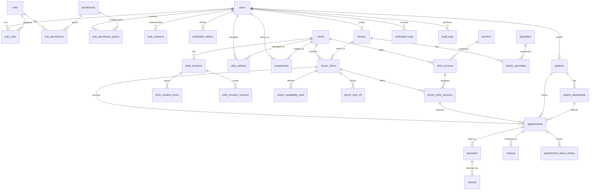

# Database Schema Blueprint

## Online Doctor Appointment Marketplace

Version: 1.0  
Date: 10 July 2026  
Database: PostgreSQL  
Backend: NestJS  

---

## 1. Design Goals

The database must support a multi-clinic doctor appointment marketplace with strict role access, reliable booking, payments, refunds, reviews, notifications, admin-configurable settings, audit logs, and future mobile apps.

Primary goals:

- Prevent double booking.
- Support doctors working across multiple clinics/locations.
- Support clinic-level and doctor-level configuration.
- Keep payment, refund, and notification records auditable.
- Keep the schema ready for scale through indexing, partitioning candidates, and clear ownership boundaries.
- Keep multi-language support possible without forcing full translation in MVP.

---

## 2. Recommended PostgreSQL Extensions

```sql
CREATE EXTENSION IF NOT EXISTS "pgcrypto";
CREATE EXTENSION IF NOT EXISTS "citext";
CREATE EXTENSION IF NOT EXISTS "btree_gist";
CREATE EXTENSION IF NOT EXISTS "pg_trgm";
```

Recommended defaults:

- Primary keys: `uuid`
- Timestamps: `timestamptz`
- Soft delete column where needed: `deleted_at timestamptz`
- Email fields: `citext`
- Money: integer minor units using `bigint`, plus ISO currency code. Example: LKR 2,500.00 is stored as `250000`, USD 25.50 is stored as `2550`.

---

## 3. Core Enums

These can be implemented as PostgreSQL enums or application-level enums with check constraints.

```text
user_status:
pending_verification, pending_approval, active, inactive, suspended, deactivated

user_role:
super_admin, clinic_admin, doctor, receptionist, patient

clinic_status:
draft, pending_approval, active, suspended, closed

doctor_status:
pending_approval, approved, rejected, suspended

clinic_association_status:
pending, approved, rejected, removed

appointment_status:
pending_payment, confirmed, checked_in, waiting, in_progress,
completed, cancelled_by_patient, cancelled_by_clinic, cancelled_by_admin,
no_show, expired

appointment_source:
patient_web, doctor_portal, receptionist_portal, admin_dashboard,
mobile_app, imported

payment_mode:
online_required, pay_at_clinic, online_optional

payment_status:
initiated, pending, successful, failed, cancelled, refunded,
partially_refunded

refund_status:
requested, under_review, approved, rejected, processing, processed, failed

review_status:
pending_moderation, approved, rejected, hidden

notification_channel:
email, sms, push

notification_status:
queued, processing, sent, failed, cancelled

audit action values:
Use flexible `action_code varchar(120)` values instead of a restrictive enum.
Examples: `permission.grant`, `doctor.document.verify`, `patient.data.view`,
`refund.approve`, `payment.webhook.process`, `settings.change`.
```

---

## 4. High-Level ERD



---

## 5. Identity And Access Tables

## 5.1 users

Stores login identity common to all roles.

| Column | Type | Notes |
|---|---|---|
| id | uuid pk | Default `gen_random_uuid()` |
| email | citext nullable | Nullable if phone-only auth is added later |
| phone | varchar(32) nullable | E.164 preferred |
| password_hash | text nullable | Nullable for OAuth-only users |
| full_name | varchar(160) | Display name |
| avatar_file_id | uuid nullable | FK to `uploaded_files` |
| status | user_status | Default `pending_verification` |
| email_verified_at | timestamptz nullable |  |
| phone_verified_at | timestamptz nullable |  |
| last_login_at | timestamptz nullable |  |
| preferred_locale | varchar(16) | Default `en` |
| created_at | timestamptz |  |
| updated_at | timestamptz |  |
| deleted_at | timestamptz nullable | Soft delete |

Indexes:

- Partial unique: `email` where `email is not null and deleted_at is null`
- Partial unique: `phone` where `phone is not null and deleted_at is null`
- Index: `(status)`

Constraints:

- Check: at least one login identity must exist. Final expression depends on OAuth design, but unreachable accounts must be prevented.

## 5.1A auth_sessions

Stores refresh-token sessions for web and mobile clients. Raw refresh tokens must never be stored.

| Column | Type | Notes |
|---|---|---|
| id | uuid pk | Session identifier |
| user_id | uuid fk users | Session owner |
| refresh_token_hash | text unique | Hash of current refresh token |
| device_id | varchar(120) nullable | Browser/mobile device identifier |
| device_name | varchar(160) nullable | Browser, OS, or mobile device label |
| ip_address | inet nullable | Creation or latest known IP |
| user_agent | text nullable | Client information |
| expires_at | timestamptz | Refresh-token expiry |
| revoked_at | timestamptz nullable | Logout, forced revocation, suspension, password change |
| last_used_at | timestamptz nullable | Refresh rotation tracking |
| created_at | timestamptz |  |
| updated_at | timestamptz |  |

Indexes:

- Index: `(user_id, revoked_at)`
- Unique: `(refresh_token_hash)`
- Index: `(expires_at)`

Constraints:

- Check: `expires_at > created_at`.
- Check: `revoked_at is null or revoked_at >= created_at`.
- Check: `last_used_at is null or last_used_at >= created_at`.
- Rule: account suspension, password change, and logout-all must revoke active sessions in a transaction.

## 5.1B verification_tokens

Stores short-lived one-time tokens for verification, reset, and invitation workflows. Raw tokens must never be stored.

| Column | Type | Notes |
|---|---|---|
| id | uuid pk |  |
| user_id | uuid fk users nullable | Nullable for invite flows before account creation |
| token_hash | text unique | Hash of verification token |
| purpose | varchar(64) | email_verification, phone_verification, password_reset, doctor_invitation, clinic_admin_invitation |
| email | citext nullable | Invite or verification target when user is not created yet |
| phone | varchar(32) nullable | Phone verification target |
| metadata | jsonb nullable | Sanitized context such as clinic invitation ID |
| expires_at | timestamptz |  |
| used_at | timestamptz nullable |  |
| created_at | timestamptz |  |

Indexes:

- Index: `(user_id, purpose, created_at desc)`
- Index: `(expires_at)`
- Unique: `(token_hash)`

Constraints:

- Check: `expires_at > created_at`.
- Check: `used_at is null or used_at >= created_at`.
- Check: `used_at is null or used_at <= expires_at`.
- Check: `user_id is not null or email is not null or phone is not null`.
- Check: `purpose in ('email_verification', 'phone_verification', 'password_reset', 'doctor_invitation', 'clinic_admin_invitation')`.
- Required trigger: purpose-specific targets must be valid. `email_verification` requires `user_id` or `email`; `phone_verification` requires `user_id` or `phone`; `password_reset` requires `user_id`; invitations require `email` or `phone`.

## 5.2 roles

| Column | Type | Notes |
|---|---|---|
| id | uuid pk |  |
| code | varchar(64) unique | `super_admin`, `doctor`, etc. |
| name | varchar(120) |  |
| description | text nullable |  |
| is_system | boolean | Prevent accidental deletion |
| created_at | timestamptz |  |

## 5.3 permissions

| Column | Type | Notes |
|---|---|---|
| id | uuid pk |  |
| code | varchar(120) unique | Example: `appointment.read` |
| module | varchar(80) | Example: `appointments` |
| description | text nullable |  |

## 5.4 user_roles

| Column | Type | Notes |
|---|---|---|
| user_id | uuid fk users | Composite unique with `role_id` |
| role_id | uuid fk roles |  |
| created_at | timestamptz |  |

## 5.5 role_permissions

| Column | Type | Notes |
|---|---|---|
| role_id | uuid fk roles | Composite unique with `permission_id` |
| permission_id | uuid fk permissions |  |

## 5.6 user_permission_grants

Supports scoped, user-level permission grants and denials required by the permission matrix.

| Column | Type | Notes |
|---|---|---|
| id | uuid pk |  |
| user_id | uuid fk users | User receiving the rule |
| permission_id | uuid fk permissions | Action permission |
| effect | varchar(16) | `allow` or `deny` |
| scope_type | varchar(32) | global, clinic, location, doctor, patient, doctor_clinic, self |
| scope_id | uuid nullable | Null only for global/self scopes |
| granted_by_user_id | uuid fk users nullable | Null for system seed |
| reason | text nullable |  |
| expires_at | timestamptz nullable | Optional temporary access |
| created_at | timestamptz |  |
| revoked_at | timestamptz nullable |  |

Indexes:

- Index: `(user_id, permission_id, scope_type, scope_id)`
- Index: `(expires_at)` where `expires_at is not null`

Constraints:

- Partial unique active scoped grant: `(user_id, permission_id, effect, scope_type, scope_id)` where `revoked_at is null and scope_id is not null`.
- Partial unique active unscoped grant: `(user_id, permission_id, effect, scope_type)` where `revoked_at is null and scope_id is null`.
- Scope check: global/self scopes require `scope_id is null`; clinic/location/doctor/patient/doctor_clinic scopes require `scope_id is not null`.
- Required trigger or application validation: scoped `scope_id` values must exist in the corresponding table (`clinics`, `clinic_locations`, `doctors`, `patients`, or `doctor_clinics`).

---

## 6. Patient Tables

## 6.1 patients

| Column | Type | Notes |
|---|---|---|
| id | uuid pk |  |
| user_id | uuid unique fk users |  |
| date_of_birth | date nullable |  |
| gender | varchar(32) nullable | Keep flexible |
| address_line1 | varchar(255) nullable |  |
| address_line2 | varchar(255) nullable |  |
| city | varchar(120) nullable |  |
| district | varchar(120) nullable | Sri Lanka search/filter support |
| country | varchar(2) | Default `LK` |
| emergency_contact_name | varchar(160) nullable |  |
| emergency_contact_phone | varchar(32) nullable |  |
| created_at | timestamptz |  |
| updated_at | timestamptz |  |

Indexes:

- Index: `(city, district)`
- Index: `(user_id)`

## 6.2 patient_dependents

Optional table for family/dependent booking. Include in MVP only if family booking is approved.

| Column | Type | Notes |
|---|---|---|
| id | uuid pk |  |
| patient_id | uuid fk patients | Account holder |
| full_name | varchar(160) | Attending person |
| relationship | varchar(80) | child, parent, spouse, other |
| date_of_birth | date nullable |  |
| gender | varchar(32) nullable |  |
| phone | varchar(32) nullable |  |
| consent_confirmed_at | timestamptz nullable |  |
| is_active | boolean |  |
| created_at | timestamptz |  |
| updated_at | timestamptz |  |

Indexes:

- Index: `(patient_id, is_active)`

---

## 7. Clinic Tables

## 7.1 clinics

| Column | Type | Notes |
|---|---|---|
| id | uuid pk |  |
| name | varchar(180) |  |
| slug | varchar(200) unique | Public URL |
| description | text nullable |  |
| logo_file_id | uuid nullable | FK to `uploaded_files` |
| status | clinic_status | Default `draft` |
| email | citext nullable |  |
| phone | varchar(32) nullable |  |
| website_url | text nullable |  |
| default_payment_mode | payment_mode nullable | Null means inherit platform default |
| cancellation_window_minutes | integer nullable | Overrides platform default |
| refund_processing_days | integer nullable | Overrides platform default |
| created_by_user_id | uuid fk users nullable |  |
| created_at | timestamptz |  |
| updated_at | timestamptz |  |
| deleted_at | timestamptz nullable |  |

Indexes:

- Unique: `slug`
- Index: `(status)`
- Index: `name gin/trigram` later if PostgreSQL text search is used

## 7.2 clinic_locations

| Column | Type | Notes |
|---|---|---|
| id | uuid pk |  |
| clinic_id | uuid fk clinics |  |
| name | varchar(160) nullable | Example: Main branch |
| address_line1 | varchar(255) |  |
| address_line2 | varchar(255) nullable |  |
| city | varchar(120) |  |
| district | varchar(120) nullable |  |
| province | varchar(120) nullable |  |
| country | varchar(2) | Default `LK` |
| timezone | varchar(64) | IANA timezone, default `Asia/Colombo` |
| latitude | numeric(10,7) nullable |  |
| longitude | numeric(10,7) nullable |  |
| phone | varchar(32) nullable |  |
| is_primary | boolean |  |
| status | varchar(32) | active/inactive |
| created_at | timestamptz |  |
| updated_at | timestamptz |  |
| deleted_at | timestamptz nullable |  |

Indexes:

- Index: `(clinic_id, status)`
- Index: `(city, district)`
- Index: `(latitude, longitude)` if map search is implemented

Constraints:

- Unique: `(id, clinic_id)` to support composite foreign keys that enforce clinic-location ownership.
- Unique primary location: `(clinic_id)` where `is_primary = true and deleted_at is null`.

## 7.2A clinic_location_hours

Defines regular operating hours for each clinic location. Slot generation must not create bookable slots outside active clinic hours.

| Column | Type | Notes |
|---|---|---|
| id | uuid pk |  |
| clinic_location_id | uuid fk clinic_locations |  |
| day_of_week | smallint | 0 Sunday through 6 Saturday |
| opens_at | time nullable | Required when `is_closed = false` |
| closes_at | time nullable | Required when `is_closed = false` |
| is_closed | boolean |  |
| effective_from | date nullable | Optional schedule start |
| effective_to | date nullable | Optional schedule end |
| created_at | timestamptz |  |
| updated_at | timestamptz |  |

Indexes:

- Index: `(clinic_location_id, day_of_week)`
- Index: `(clinic_location_id, effective_from, effective_to)`

Constraints:

- Check: `day_of_week between 0 and 6`.
- Check: `is_closed = true or (opens_at is not null and closes_at is not null and closes_at > opens_at)`.
- Check: `is_closed = false or (opens_at is null and closes_at is null)`.
- Check: `effective_to is null or effective_from is null or effective_to >= effective_from`.
- Required trigger: allow multiple operating periods per day, but reject overlapping active time windows for the same `clinic_location_id`, `day_of_week`, and overlapping effective date range.

## 7.2B clinic_location_closures

Defines exceptional closures such as holidays, emergency closures, and maintenance windows.

| Column | Type | Notes |
|---|---|---|
| id | uuid pk |  |
| clinic_location_id | uuid fk clinic_locations |  |
| starts_at | timestamptz |  |
| ends_at | timestamptz |  |
| reason | varchar(255) nullable |  |
| created_by_user_id | uuid fk users |  |
| created_at | timestamptz |  |

Indexes:

- Index: `(clinic_location_id, starts_at, ends_at)`

Constraints:

- Check: `ends_at > starts_at`.

## 7.3 clinic_admins

| Column | Type | Notes |
|---|---|---|
| id | uuid pk |  |
| clinic_id | uuid fk clinics |  |
| user_id | uuid fk users |  |
| status | varchar(32) | active/suspended |
| created_at | timestamptz |  |

Constraints:

- Unique: `(clinic_id, user_id)`

## 7.4 receptionists

| Column | Type | Notes |
|---|---|---|
| id | uuid pk |  |
| clinic_id | uuid fk clinics |  |
| clinic_location_id | uuid fk clinic_locations nullable | Null means all locations in clinic |
| user_id | uuid fk users |  |
| status | varchar(32) | active/suspended |
| created_at | timestamptz |  |
| updated_at | timestamptz |  |

Constraints:

- Unique: `(clinic_id, user_id)`
- Composite FK: `(clinic_location_id, clinic_id)` references `clinic_locations(id, clinic_id)` when `clinic_location_id` is not null.

---

## 8. Doctor Tables

## 8.1 doctors

| Column | Type | Notes |
|---|---|---|
| id | uuid pk |  |
| user_id | uuid unique fk users |  |
| slug | varchar(200) unique | Public URL |
| license_number | varchar(120) nullable | Could be mandatory after policy decision |
| status | doctor_status | Default `pending_approval` |
| bio | text nullable |  |
| qualifications | text nullable | MVP text, can normalize later |
| years_experience | integer nullable |  |
| languages | text[] | Example: `{en,ta,si}` |
| profile_file_id | uuid nullable | FK to `uploaded_files` |
| approved_at | timestamptz nullable |  |
| approved_by_user_id | uuid fk users nullable |  |
| rejection_reason | text nullable |  |
| created_at | timestamptz |  |
| updated_at | timestamptz |  |
| deleted_at | timestamptz nullable |  |

Indexes:

- Unique: `slug`
- Index: `(status)`
- Index: `(license_number)`

## 8.2 doctor_documents

| Column | Type | Notes |
|---|---|---|
| id | uuid pk |  |
| doctor_id | uuid fk doctors |  |
| file_id | uuid fk uploaded_files |  |
| document_type | varchar(80) | license, certificate, identity, other |
| platform_status | varchar(32) | pending, approved, rejected |
| platform_reviewed_by_user_id | uuid fk users nullable |  |
| platform_reviewed_at | timestamptz nullable |  |
| platform_rejection_reason | text nullable |  |
| created_at | timestamptz |  |

Constraints:

- Check: `platform_status <> 'rejected' or platform_rejection_reason is not null`.

## 8.2A doctor_document_clinic_reviews

Stores clinic-scoped document review without changing platform identity verification status.

| Column | Type | Notes |
|---|---|---|
| id | uuid pk |  |
| doctor_document_id | uuid fk doctor_documents |  |
| clinic_id | uuid fk clinics |  |
| doctor_clinic_id | uuid fk doctor_clinics | Association being reviewed |
| status | varchar(32) | pending, approved, rejected |
| reviewed_by_user_id | uuid fk users nullable |  |
| reviewed_at | timestamptz nullable |  |
| reason | text nullable |  |
| created_at | timestamptz |  |

Indexes:

- Index: `(doctor_document_id, clinic_id)`
- Index: `(doctor_clinic_id, status)`

Constraints:

- Unique: `(doctor_document_id, doctor_clinic_id)`.
- Required trigger: `doctor_document_id` must belong to the doctor referenced by `doctor_clinic_id`.
- Required trigger: `doctor_clinic_id` must belong to `clinic_id`.
- Check: `status <> 'rejected' or reason is not null`.

## 8.3 specialties

| Column | Type | Notes |
|---|---|---|
| id | uuid pk |  |
| name | varchar(160) |  |
| slug | varchar(180) unique |  |
| description | text nullable |  |
| parent_id | uuid fk specialties nullable | For hierarchy |
| is_active | boolean |  |
| created_at | timestamptz |  |

## 8.4 doctor_specialties

| Column | Type | Notes |
|---|---|---|
| doctor_id | uuid fk doctors | Composite unique with `specialty_id` |
| specialty_id | uuid fk specialties |  |
| is_primary | boolean |  |
| created_at | timestamptz |  |

Constraints:

- Unique: `(doctor_id, specialty_id)`.
- Unique primary specialty: `(doctor_id)` where `is_primary = true`.

## 8.5 services

Master list of appointment service types.

| Column | Type | Notes |
|---|---|---|
| id | uuid pk |  |
| name | varchar(160) | General consultation, follow-up, etc. |
| slug | varchar(180) unique |  |
| description | text nullable |  |
| default_duration_minutes | integer |  |
| is_active | boolean |  |
| created_at | timestamptz |  |
| updated_at | timestamptz |  |

Indexes:

- Unique: `slug`
- Index: `(is_active)`

Constraints:

- Check: `default_duration_minutes > 0`.

## 8.6 clinic_services

Services enabled by a clinic.

| Column | Type | Notes |
|---|---|---|
| id | uuid pk |  |
| clinic_id | uuid fk clinics |  |
| service_id | uuid fk services |  |
| display_name | varchar(160) nullable | Clinic-specific label |
| description | text nullable |  |
| is_active | boolean |  |
| created_at | timestamptz |  |
| updated_at | timestamptz |  |

Constraints:

- Unique: `(clinic_id, service_id)`
- Unique: `(id, clinic_id, service_id)` to support service-consistency checks.
- Check: service duration rules are enforced through the referenced master service and doctor-clinic service duration.

## 8.7 doctor_clinics

Connects doctors to clinics and locations. This is central to marketplace behavior.

| Column | Type | Notes |
|---|---|---|
| id | uuid pk |  |
| doctor_id | uuid fk doctors |  |
| clinic_id | uuid fk clinics |  |
| clinic_location_id | uuid fk clinic_locations |  |
| status | clinic_association_status | Default `pending` |
| default_consultation_fee_minor | bigint nullable | Fallback if no service fee exists |
| default_consultation_fee_currency | varchar(3) | Default `LKR` |
| payment_mode | payment_mode nullable | Overrides clinic/platform setting |
| default_slot_interval_minutes | integer | Default 15 or 30; interval between available start times |
| buffer_minutes | integer | Default 0 |
| approved_by_user_id | uuid fk users nullable |  |
| approved_at | timestamptz nullable |  |
| created_at | timestamptz |  |
| updated_at | timestamptz |  |
| deleted_at | timestamptz nullable |  |

Constraints:

- Unique active association: `(doctor_id, clinic_id, clinic_location_id)` where `deleted_at is null`
- Unique: `(id, doctor_id, clinic_id, clinic_location_id)` to support appointment consistency checks.
- Composite FK: `(clinic_location_id, clinic_id)` references `clinic_locations(id, clinic_id)`.
- Check: `default_slot_interval_minutes > 0`.
- Check: `buffer_minutes >= 0`.
- If status is set to `removed`, either set `deleted_at` or exclude `removed` from the active association unique index in the physical migration.

Indexes:

- Index: `(clinic_id, status)`
- Index: `(doctor_id, status)`
- Index: `(clinic_location_id)`

## 8.8 doctor_clinic_services

Services a doctor offers at a specific clinic/location.

| Column | Type | Notes |
|---|---|---|
| id | uuid pk |  |
| doctor_clinic_id | uuid fk doctor_clinics |  |
| clinic_service_id | uuid fk clinic_services |  |
| duration_minutes | integer |  |
| fee_minor | bigint nullable |  |
| fee_currency | varchar(3) | Default `LKR` |
| payment_mode | payment_mode nullable | Overrides doctor-clinic/clinic/platform setting |
| cancellation_window_minutes | integer nullable | Optional override |
| reschedule_window_minutes | integer nullable | Optional override |
| max_reschedules | integer nullable | Optional override |
| is_active | boolean |  |
| created_at | timestamptz |  |
| updated_at | timestamptz |  |
| deleted_at | timestamptz nullable |  |

Constraints:

- Unique active service: `(doctor_clinic_id, clinic_service_id)` where `deleted_at is null`
- Required trigger: `clinic_service_id` must belong to the same clinic as the referenced `doctor_clinic_id`.
- Service is resolved through `doctor_clinic_services -> clinic_services -> services`; do not duplicate `service_id` in this table.
- Check: `duration_minutes > 0`.
- Check: `fee_minor is null or fee_minor >= 0`.

Indexes:

- Index: `(doctor_clinic_id, is_active)`

---

## 9. Availability And Scheduling Tables

## 9.1 doctor_availability_rules

Defines recurring weekly availability.

| Column | Type | Notes |
|---|---|---|
| id | uuid pk |  |
| doctor_clinic_id | uuid fk doctor_clinics |  |
| day_of_week | smallint | 0 Sunday through 6 Saturday |
| start_time | time | Local clinic time |
| end_time | time | Local clinic time |
| slot_interval_minutes | integer nullable | Overrides doctor_clinic default start interval |
| max_patients_per_slot | integer | Default 1; MVP requires 1 |
| is_active | boolean |  |
| effective_from | date nullable |  |
| effective_to | date nullable |  |
| created_at | timestamptz |  |
| updated_at | timestamptz |  |

Indexes:

- Index: `(doctor_clinic_id, day_of_week, is_active)`

Constraints:

- Check: `day_of_week between 0 and 6`.
- Check: `end_time > start_time`.
- Check: `slot_interval_minutes is null or slot_interval_minutes > 0`.
- Check: `max_patients_per_slot = 1` for MVP.
- Check: `effective_to is null or effective_from is null or effective_to >= effective_from`.
- Required trigger: allow split schedules, but reject overlapping active time windows for the same `doctor_clinic_id`, `day_of_week`, and overlapping effective date range.

## 9.2 doctor_availability_breaks

Optional recurring breaks inside availability windows.

| Column | Type | Notes |
|---|---|---|
| id | uuid pk |  |
| availability_rule_id | uuid fk doctor_availability_rules |  |
| start_time | time |  |
| end_time | time |  |
| created_at | timestamptz |  |

Constraints:

- Check: `end_time > start_time`.

## 9.3 doctor_time_off

Blocks specific dates/times for holidays, leave, emergency closure.

| Column | Type | Notes |
|---|---|---|
| id | uuid pk |  |
| doctor_clinic_id | uuid fk doctor_clinics |  |
| doctor_clinic_service_id | uuid fk doctor_clinic_services nullable | Optional if slots are service-specific |
| starts_at | timestamptz |  |
| ends_at | timestamptz |  |
| reason | varchar(255) nullable |  |
| created_by_user_id | uuid fk users |  |
| created_at | timestamptz |  |

Indexes:

- Index: `(doctor_clinic_id, starts_at, ends_at)`

Constraints:

- Check: `ends_at > starts_at`.
- Required trigger: when `doctor_clinic_service_id` is provided, it must belong to the same `doctor_clinic_id`.

## 9.4 appointment_slots

Optional materialized slots table. Recommended for MVP if the UI needs fast availability lookup and slot locking.

| Column | Type | Notes |
|---|---|---|
| id | uuid pk |  |
| doctor_clinic_id | uuid fk doctor_clinics |  |
| doctor_clinic_service_id | uuid fk doctor_clinic_services | Service-specific slot for MVP |
| starts_at | timestamptz |  |
| ends_at | timestamptz |  |
| capacity | integer | Default 1; MVP shall enforce 1 unless group bookings are approved |
| is_active | boolean |  |
| created_at | timestamptz |  |
| updated_at | timestamptz |  |

Constraints:

- Unique: `(doctor_clinic_id, doctor_clinic_service_id, starts_at, ends_at)`
- Check: `ends_at > starts_at`
- Check: `capacity = 1` for MVP.
- Required trigger: `doctor_clinic_service_id` must belong to the same `doctor_clinic_id`.
- Required trigger: `ends_at - starts_at` must equal the referenced `doctor_clinic_services.duration_minutes`.

Indexes:

- Index: `(doctor_clinic_id, starts_at)`
- Index: `(doctor_clinic_service_id, starts_at)`
- Index: `(starts_at, is_active)`

## 9.5 appointment_slot_holds

Separate slot holds for online-payment reservations and idempotent booking attempts.

| Column | Type | Notes |
|---|---|---|
| id | uuid pk |  |
| appointment_slot_id | uuid fk appointment_slots |  |
| user_id | uuid fk users | User creating the hold |
| appointment_id | uuid fk appointments nullable | Set after appointment draft/pending payment is created |
| idempotency_key | varchar(120) unique |  |
| status | varchar(32) | active, converted, expired, released, cancelled |
| expires_at | timestamptz | Default 10 minutes for online payment |
| resolved_at | timestamptz nullable | Set when hold reaches a terminal status |
| created_at | timestamptz |  |
| updated_at | timestamptz |  |

Indexes:

- Index: `(appointment_slot_id, status, expires_at)`
- Index: `(user_id, created_at desc)`
- Index: `(expires_at)` where `status = 'active'`

Constraints:

- Partial unique active slot hold: `(appointment_slot_id)` where `status = 'active'`.
- Partial unique active appointment hold: `(appointment_id)` where `appointment_id is not null and status = 'active'`.
- Check: `expires_at > created_at`.
- Check or trigger: `status in ('active', 'converted')` requires `appointment_id is not null` before commit.
- Check or trigger: `status = 'active'` requires `resolved_at is null`.
- Check or trigger: terminal statuses `converted`, `expired`, `released`, and `cancelled` require `resolved_at is not null`.

---

## 10. Appointment Tables

## 10.1 appointments

| Column | Type | Notes |
|---|---|---|
| id | uuid pk |  |
| appointment_number | varchar(40) unique | Human readable |
| patient_id | uuid fk patients |  |
| doctor_id | uuid fk doctors | Denormalized for fast queries |
| clinic_id | uuid fk clinics | Denormalized for fast queries |
| clinic_location_id | uuid fk clinic_locations |  |
| doctor_clinic_id | uuid fk doctor_clinics | Source association |
| doctor_clinic_service_id | uuid fk doctor_clinic_services | Selected service |
| appointment_slot_id | uuid fk appointment_slots nullable | Required unless manual override/import |
| is_manual_override | boolean | Default false; only admin/import/emergency bookings may bypass slot requirement |
| manual_override_reason | text nullable | Required when bypassing a materialized slot |
| starts_at | timestamptz |  |
| ends_at | timestamptz |  |
| status | appointment_status |  |
| source | appointment_source |  |
| payment_mode | payment_mode | Resolved at booking time |
| service_name_snapshot | varchar(160) | Snapshot at booking |
| consultation_fee_minor | bigint | Snapshot at booking; use 0 for free appointments |
| consultation_fee_currency | varchar(3) | Default `LKR` |
| attending_patient_id | uuid fk patients nullable | Null if dependent is attending |
| attending_dependent_id | uuid fk patient_dependents nullable | Null if account holder is attending |
| attending_name_snapshot | varchar(160) | Attending person at booking time |
| attending_relationship_snapshot | varchar(80) nullable | Self, child, parent, etc. |
| reason_for_visit | varchar(500) nullable | Limited booking reason; avoid unrestricted medical history |
| booking_notes | varchar(1000) nullable | Optional patient booking note; visibility controlled by permissions |
| internal_notes | text nullable | Admin/reception operational notes, not public |
| queue_date | date nullable | Clinic-local queue date |
| queue_number | integer nullable | Clinic daily queue/token |
| checked_in_at | timestamptz nullable |  |
| consultation_started_at | timestamptz nullable |  |
| consultation_completed_at | timestamptz nullable |  |
| cancelled_at | timestamptz nullable |  |
| cancelled_by_user_id | uuid fk users nullable |  |
| cancellation_reason | text nullable |  |
| created_by_user_id | uuid fk users | Patient/receptionist/admin |
| updated_by_user_id | uuid fk users nullable |  |
| created_at | timestamptz |  |
| updated_at | timestamptz |  |

Critical constraints:

- Check: `ends_at > starts_at`
- Check: `consultation_fee_minor >= 0`
- Check: `queue_number is null or queue_number > 0`
- Check: `num_nonnulls(attending_patient_id, attending_dependent_id) = 1`
- Application or trigger validation: `attending_patient_id` must equal `patient_id` for self-booking.
- Application or trigger validation: `attending_dependent_id` must belong to `patient_id` and be active for new appointments.
- Exclusion constraint: prevent overlapping active appointments for the same `doctor_id` using GiST on `tstzrange(starts_at, ends_at, '[)')` where status is `pending_payment`, `confirmed`, `checked_in`, `waiting`, or `in_progress`.
- Required composite FK or trigger: `doctor_id`, `clinic_id`, and `clinic_location_id` must match the referenced `doctor_clinic_id`.
- Required composite FK or trigger: `doctor_clinic_service_id` must belong to the referenced `doctor_clinic_id`.
- Check or trigger: `appointment_slot_id is not null or is_manual_override = true`.
- Required trigger when `appointment_slot_id is not null`: appointment `doctor_clinic_id`, `doctor_clinic_service_id`, `starts_at`, and `ends_at` must match the referenced slot.
- Manual override trigger: when `is_manual_override = true and appointment_slot_id is null`, `source` must be `admin_dashboard`, `receptionist_portal`, or `imported`, and `manual_override_reason` must be populated.
- Status consistency trigger: cancelled statuses require `cancelled_at`; `cancelled_by_user_id` is required except for approved system expiration flows.
- Status consistency trigger: non-cancelled statuses should keep `cancelled_at` null unless preserving legacy/import data.
- Status consistency trigger: `completed` requires `consultation_completed_at`; `checked_in`, `waiting`, `in_progress`, and `completed` require `checked_in_at`.
- Unique active slot booking for single-capacity appointments:
  - If using `appointment_slot_id`: unique partial index on `(appointment_slot_id)` where `appointment_slot_id is not null and status in ('pending_payment', 'confirmed', 'checked_in', 'waiting', 'in_progress')`.
  - If not using slots: use the doctor-wide exclusion constraint above; do not rely only on `(doctor_clinic_id, starts_at)` because one doctor can work across multiple clinics.

Recommended indexes:

- Index: `(patient_id, starts_at desc)`
- Index: `(doctor_id, starts_at desc)`
- Index: `(clinic_id, starts_at desc)`
- Index: `(clinic_location_id, starts_at desc)`
- Index: `(doctor_clinic_service_id, starts_at desc)`
- Index: `(status, starts_at)`
- Index: `(doctor_clinic_id, starts_at)`
- Index: `(clinic_id, starts_at, queue_number)`
- Index: `(created_at)`

Queue uniqueness:

- Unique where `queue_number is not null`: `(clinic_location_id, doctor_id, queue_date, queue_number)`.

## 10.2 appointment_status_history

| Column | Type | Notes |
|---|---|---|
| id | uuid pk |  |
| appointment_id | uuid fk appointments |  |
| from_status | appointment_status nullable |  |
| to_status | appointment_status |  |
| changed_by_user_id | uuid fk users nullable | System nullable |
| reason | text nullable |  |
| metadata | jsonb nullable |  |
| created_at | timestamptz |  |

Indexes:

- Index: `(appointment_id, created_at)`

## 10.3 appointment_reschedule_requests

Useful if rescheduling needs approval later. Can be skipped for MVP if reschedule is immediate.

| Column | Type | Notes |
|---|---|---|
| id | uuid pk |  |
| appointment_id | uuid fk appointments |  |
| requested_by_user_id | uuid fk users |  |
| old_appointment_slot_id | uuid fk appointment_slots nullable | Snapshot before reschedule |
| new_appointment_slot_id | uuid fk appointment_slots nullable | Requested target slot |
| old_doctor_clinic_service_id | uuid fk doctor_clinic_services | Snapshot before reschedule |
| new_doctor_clinic_service_id | uuid fk doctor_clinic_services | Requested target service |
| old_starts_at | timestamptz |  |
| old_ends_at | timestamptz |  |
| new_starts_at | timestamptz |  |
| new_ends_at | timestamptz |  |
| old_fee_minor | bigint | Snapshot before reschedule |
| new_fee_minor | bigint | Requested fee after reschedule |
| fee_difference_minor | bigint | Can be positive, zero, or negative |
| currency | varchar(3) |  |
| status | varchar(32) | pending, approved, rejected, applied |
| reason | text nullable |  |
| created_at | timestamptz |  |
| resolved_at | timestamptz nullable |  |

Constraints:

- Check: `new_ends_at > new_starts_at` and `old_ends_at > old_starts_at`.
- Check: `old_fee_minor >= 0 and new_fee_minor >= 0`.
- Check: `fee_difference_minor = new_fee_minor - old_fee_minor`.
- Check or trigger: `resolved_at` is required when `status in ('approved', 'rejected', 'applied')`.
- Required trigger when slot IDs are present: old/new slot IDs must match the corresponding old/new service IDs and timestamps.

---

## 11. Payments And Refunds

## 11.1 payments

| Column | Type | Notes |
|---|---|---|
| id | uuid pk |  |
| appointment_id | uuid fk appointments |  |
| patient_id | uuid fk patients |  |
| provider | varchar(80) | payhere, stripe, manual |
| provider_payment_id | varchar(255) nullable |  |
| idempotency_key | varchar(120) unique nullable |  |
| payment_purpose | varchar(64) | appointment_charge, reschedule_difference, manual_adjustment |
| parent_payment_id | uuid fk payments nullable | For follow-up/difference payments |
| related_reschedule_request_id | uuid fk appointment_reschedule_requests nullable |  |
| amount_minor | bigint |  |
| currency | varchar(3) |  |
| status | payment_status |  |
| payment_method | varchar(80) nullable | card, wallet, cash, etc. |
| gateway_response | jsonb nullable | Sanitized only |
| paid_at | timestamptz nullable |  |
| created_at | timestamptz |  |
| updated_at | timestamptz |  |

Indexes:

- Index: `(appointment_id)`
- Index: `(patient_id, created_at desc)`
- Partial unique: `(provider, provider_payment_id)` where `provider_payment_id is not null`
- Index: `(status, created_at)`

Constraints:

- Check: `amount_minor > 0`.
- Check: `payment_purpose in ('appointment_charge', 'reschedule_difference', 'manual_adjustment')`.
- Check: `parent_payment_id is null or parent_payment_id <> id`.
- Check or trigger: `payment_purpose = 'reschedule_difference'` requires `related_reschedule_request_id is not null`.
- Check or trigger: `payment_purpose = 'appointment_charge'` requires `related_reschedule_request_id is null`.
- Required trigger or composite relationship check: payment `patient_id` must match the referenced appointment's booking patient.
- Required trigger: `parent_payment_id`, when present, must belong to the same appointment and use the same currency.

## 11.2 payment_webhook_events

Stores raw/sanitized webhook events for audit and retry safety.

| Column | Type | Notes |
|---|---|---|
| id | uuid pk |  |
| provider | varchar(80) |  |
| provider_event_id | varchar(255) nullable | Unique if provider supports |
| event_type | varchar(120) |  |
| payload | jsonb | Sanitized payload |
| signature_valid | boolean |  |
| processed_at | timestamptz nullable |  |
| processing_error | text nullable |  |
| created_at | timestamptz |  |

Constraints:

- Unique: `(provider, provider_event_id)` where `provider_event_id is not null`

## 11.3 refunds

| Column | Type | Notes |
|---|---|---|
| id | uuid pk |  |
| payment_id | uuid fk payments |  |
| appointment_id | uuid fk appointments |  |
| requested_by_user_id | uuid fk users |  |
| reviewed_by_user_id | uuid fk users nullable |  |
| provider | varchar(80) | payhere, stripe, manual |
| provider_refund_id | varchar(255) nullable |  |
| amount_minor | bigint |  |
| currency | varchar(3) |  |
| status | refund_status |  |
| reason | text | Mandatory refund reason |
| admin_notes | text nullable |  |
| requested_at | timestamptz |  |
| reviewed_at | timestamptz nullable |  |
| processed_at | timestamptz nullable |  |
| created_at | timestamptz |  |
| updated_at | timestamptz |  |

Indexes:

- Index: `(payment_id)`
- Index: `(appointment_id)`
- Index: `(status, requested_at)`
- Partial unique: `(provider, provider_refund_id)` where `provider_refund_id is not null`

Constraints:

- Check: `amount_minor > 0`.
- Refund provider should match the payment provider unless a Super Admin records an approved manual exception.
- Refund currency must equal payment currency.
- Refund appointment must match the payment appointment.
- Only successful or partially refunded payments can be refunded.
- Total processed refund amount for a payment must not exceed the successful payment amount. Enforce inside the refund-processing transaction.

## 11.4 payment_status_history

| Column | Type | Notes |
|---|---|---|
| id | uuid pk |  |
| payment_id | uuid fk payments |  |
| from_status | payment_status nullable |  |
| to_status | payment_status |  |
| webhook_event_id | uuid fk payment_webhook_events nullable |  |
| actor_user_id | uuid fk users nullable | Null for system/webhook |
| reason | text nullable |  |
| metadata | jsonb nullable | Sanitized |
| created_at | timestamptz |  |

Indexes:

- Index: `(payment_id, created_at)`

## 11.5 refund_status_history

| Column | Type | Notes |
|---|---|---|
| id | uuid pk |  |
| refund_id | uuid fk refunds |  |
| from_status | refund_status nullable |  |
| to_status | refund_status |  |
| actor_user_id | uuid fk users nullable | Null for system/webhook |
| reason | text nullable |  |
| metadata | jsonb nullable | Sanitized |
| created_at | timestamptz |  |

Indexes:

- Index: `(refund_id, created_at)`

---

## 12. Reviews And Ratings

## 12.1 reviews

| Column | Type | Notes |
|---|---|---|
| id | uuid pk |  |
| appointment_id | uuid unique fk appointments | One review per completed appointment |
| patient_id | uuid fk patients |  |
| doctor_id | uuid fk doctors |  |
| clinic_id | uuid fk clinics |  |
| rating | smallint | 1 through 5 |
| title | varchar(160) nullable |  |
| comment | text nullable |  |
| status | review_status | Default `pending_moderation` |
| moderated_by_user_id | uuid fk users nullable |  |
| moderated_at | timestamptz nullable |  |
| moderation_reason | text nullable |  |
| created_at | timestamptz |  |
| updated_at | timestamptz |  |

Constraints:

- Check: `rating between 1 and 5`
- Required trigger: review `patient_id`, `doctor_id`, and `clinic_id` must match the referenced appointment.
- Required trigger: review can be created only when the referenced appointment status is `completed`.

Indexes:

- Index: `(doctor_id, status, created_at desc)`
- Index: `(clinic_id, status, created_at desc)`
- Index: `(patient_id, created_at desc)`

## 12.2 doctor_rating_summaries

Optional denormalized summary for fast listing pages.

| Column | Type | Notes |
|---|---|---|
| doctor_id | uuid pk fk doctors |  |
| average_rating | numeric(3,2) | Default 0 |
| review_count | integer | Default 0 |
| updated_at | timestamptz |  |

---

## 13. Notifications

## 13.1 notification_templates

| Column | Type | Notes |
|---|---|---|
| id | uuid pk |  |
| scope_type | varchar(32) | platform, clinic |
| scope_id | uuid nullable | Null for platform template |
| event_code | varchar(120) | booking_confirmed, etc. |
| channel | notification_channel |  |
| locale | varchar(16) | Default `en` |
| subject | varchar(255) nullable | Email only |
| body | text | Template body |
| is_active | boolean |  |
| created_at | timestamptz |  |
| updated_at | timestamptz |  |

Constraints:

- Partial unique platform template: `(event_code, channel, locale)` where `scope_id is null`.
- Partial unique scoped template: `(scope_type, scope_id, event_code, channel, locale)` where `scope_id is not null`.
- Scope check: `platform` requires `scope_id is null`; `clinic` requires `scope_id is not null`.
- Required trigger or application validation: when `scope_type = 'clinic'`, `scope_id` must exist in `clinics`.

## 13.2 notification_logs

| Column | Type | Notes |
|---|---|---|
| id | uuid pk |  |
| user_id | uuid fk users nullable | Recipient user |
| appointment_id | uuid fk appointments nullable | Related event |
| channel | notification_channel |  |
| event_code | varchar(120) |  |
| idempotency_key | varchar(160) nullable | Deduplicate retried jobs |
| recipient | varchar(255) | Email, phone, device token |
| subject | varchar(255) nullable |  |
| body | text nullable | Rendered content; redact/encrypt or omit sensitive content based on retention policy |
| status | notification_status |  |
| provider | varchar(80) nullable |  |
| provider_message_id | varchar(255) nullable |  |
| error_message | text nullable |  |
| attempts | integer | Default 0 |
| scheduled_at | timestamptz nullable | For reminders |
| sent_at | timestamptz nullable |  |
| created_at | timestamptz |  |
| updated_at | timestamptz |  |

Indexes:

- Index: `(user_id, created_at desc)`
- Index: `(status, scheduled_at)`
- Index: `(appointment_id)`
- Partial unique: `(idempotency_key)` where `idempotency_key is not null`

Retention/security notes:

- Rendered notification bodies may contain patient or appointment data. Retention period, redaction policy, and log viewer permissions must be finalized before production.

## 13.3 user_push_tokens

| Column | Type | Notes |
|---|---|---|
| id | uuid pk |  |
| user_id | uuid fk users |  |
| token | text unique | Firebase token |
| platform | varchar(32) | web, ios, android |
| device_id | varchar(120) nullable |  |
| is_active | boolean |  |
| last_seen_at | timestamptz nullable |  |
| created_at | timestamptz |  |

---

## 14. Settings And Configuration

## 14.1 system_settings

Generic key/value settings. Keep highly sensitive secrets in a secrets manager if available.

| Column | Type | Notes |
|---|---|---|
| id | uuid pk |  |
| scope_type | varchar(32) | platform, clinic, doctor_clinic |
| scope_id | uuid nullable | Null for platform |
| key | varchar(160) |  |
| value | jsonb |  |
| is_encrypted | boolean |  |
| updated_by_user_id | uuid fk users nullable |  |
| created_at | timestamptz |  |
| updated_at | timestamptz |  |

Constraints:

- Partial unique platform setting: `(scope_type, key)` where `scope_id is null`.
- Partial unique scoped setting: `(scope_type, scope_id, key)` where `scope_id is not null`.
- Scope check: `platform` requires `scope_id is null`; `clinic` and `doctor_clinic` require `scope_id is not null`.
- Required trigger or application validation: scoped `scope_id` values must exist in the corresponding table (`clinics` or `doctor_clinics`).

Suggested keys:

- `default_payment_mode`
- `cancellation_window_minutes`
- `refund_processing_days`
- `platform_commission`
- `email_provider`
- `sms_provider`
- `push_provider`
- `review_auto_approval`
- `supported_locales`

## 14.2 provider_configurations

Stores configuration metadata for payment, email, SMS, and push providers.

| Column | Type | Notes |
|---|---|---|
| id | uuid pk |  |
| provider_type | varchar(40) | payment, email, sms, push |
| provider_code | varchar(80) | payhere, stripe, sendgrid, etc. |
| scope_type | varchar(32) | platform, clinic |
| scope_id | uuid nullable |  |
| display_name | varchar(160) |  |
| config | jsonb | Encrypted where needed |
| is_active | boolean |  |
| is_encrypted | boolean |  |
| updated_by_user_id | uuid fk users nullable |  |
| created_at | timestamptz |  |
| updated_at | timestamptz |  |

Constraints:

- Partial unique platform provider: `(provider_type, provider_code, scope_type)` where `scope_id is null`.
- Partial unique scoped provider: `(provider_type, provider_code, scope_type, scope_id)` where `scope_id is not null`.
- Scope check: `platform` requires `scope_id is null`; `clinic` requires `scope_id is not null`.
- Required trigger or application validation: when `scope_type = 'clinic'`, `scope_id` must exist in `clinics`.
- MVP check or feature-flag rule: `provider_type = 'payment'` requires `scope_type = 'platform'` until clinic-owned merchant accounts are explicitly approved.

---

## 15. Files And Documents

## 15.1 uploaded_files

| Column | Type | Notes |
|---|---|---|
| id | uuid pk |  |
| uploaded_by_user_id | uuid fk users nullable |  |
| storage_provider | varchar(80) | s3, local, gcs, etc. |
| bucket | varchar(160) nullable |  |
| object_key | text |  |
| original_filename | varchar(255) |  |
| mime_type | varchar(120) |  |
| size_bytes | bigint |  |
| checksum | varchar(128) nullable |  |
| visibility | varchar(32) | private, public |
| created_at | timestamptz |  |
| deleted_at | timestamptz nullable |  |

Indexes:

- Index: `(uploaded_by_user_id, created_at desc)`
- Index: `(object_key)`
- Partial unique expression index: `(storage_provider, COALESCE(bucket, ''), object_key)` where `deleted_at is null`.

---

## 16. Audit And Compliance

## 16.1 audit_logs

| Column | Type | Notes |
|---|---|---|
| id | uuid pk |  |
| actor_user_id | uuid fk users nullable | Null for system |
| actor_role | varchar(64) nullable | Role active during action |
| action_code | varchar(120) | Flexible action code such as `permission.grant` or `refund.approve` |
| entity_type | varchar(120) | appointments, users, payments, etc. |
| entity_id | uuid nullable |  |
| clinic_id | uuid nullable | For scoping |
| patient_id | uuid nullable | For PHI audit |
| ip_address | inet nullable |  |
| user_agent | text nullable |  |
| correlation_id | varchar(120) nullable | Request/job trace ID |
| before_data | jsonb nullable | Sensitive fields redacted |
| after_data | jsonb nullable | Sensitive fields redacted |
| metadata | jsonb nullable |  |
| created_at | timestamptz |  |

Indexes:

- Index: `(actor_user_id, created_at desc)`
- Index: `(entity_type, entity_id, created_at desc)`
- Index: `(clinic_id, created_at desc)`
- Index: `(patient_id, created_at desc)`
- Index: `(created_at)`

Partitioning candidate:

- Partition by month when volume grows.

Audit records must be append-only from normal application operations.

## 16.2 consent_records

| Column | Type | Notes |
|---|---|---|
| id | uuid pk |  |
| user_id | uuid fk users |  |
| consent_type | varchar(80) | terms, privacy, marketing, medical_data |
| version | varchar(40) | Policy version |
| accepted | boolean |  |
| recorded_at | timestamptz | Timestamp when consent decision was recorded |
| withdrawn_at | timestamptz nullable | Optional withdrawal timestamp |
| ip_address | inet nullable |  |
| user_agent | text nullable |  |

Indexes:

- Index: `(user_id, consent_type, recorded_at desc)`

Constraints:

- Check: `withdrawn_at is null or withdrawn_at >= recorded_at`.
- Rule: `accepted = false` with `withdrawn_at is null` represents an explicit recorded rejection decision at `recorded_at`; `withdrawn_at` is used only for later withdrawal of previously accepted consent.

---

## 17. Multi-Language Tables

MVP can use frontend translation files only. Database-level translations are optional but useful for admin-managed content.

## 17.1 translations

| Column | Type | Notes |
|---|---|---|
| id | uuid pk |  |
| entity_type | varchar(120) | clinic, specialty, page, setting |
| entity_id | uuid nullable |  |
| field_name | varchar(120) | name, description, etc. |
| locale | varchar(16) | en, ta, si |
| value | text |  |
| created_at | timestamptz |  |
| updated_at | timestamptz |  |

Constraints:

- Partial unique global translation: `(entity_type, field_name, locale)` where `entity_id is null`.
- Partial unique entity translation: `(entity_type, entity_id, field_name, locale)` where `entity_id is not null`.

---

## 18. Booking Consistency Strategy

Booking is the most sensitive workflow. The backend must enforce consistency in PostgreSQL, not only in application code.

Recommended MVP approach:

1. Generate or resolve the target slot.
2. Confirm clinic location is open and not closed for the requested time.
3. Confirm doctor is available and not on time off.
4. Confirm service and doctor-clinic association are active/approved.
5. Start database transaction.
6. Lock slot row with `SELECT ... FOR UPDATE`.
7. Confirm slot is active and has no active appointment or active unexpired hold.
8. For online-required payment, create an `appointment_slot_holds` record with a unique idempotency key and `active` status.
9. Create appointment with status `pending_payment` or `confirmed`.
10. Availability queries must treat active appointments and active unexpired holds as unavailable.
11. Commit transaction.
12. Trigger notifications/payment flow through BullMQ.

For online-required payments:

1. Create appointment as `pending_payment`.
2. Create an active `appointment_slot_holds` record with `expires_at`.
3. Redirect/initiate payment.
4. Payment webhook marks payment successful idempotently.
5. Appointment becomes `confirmed`.
6. Slot hold becomes `converted`.
7. Expired pending payments are released by background job and the slot hold becomes `expired`.

Hold expiration must be atomic:

1. Lock the active hold.
2. Lock the pending-payment appointment.
3. Confirm no successful payment exists.
4. Set the appointment to `expired`.
5. Set the hold to `expired`.
6. Write appointment status history.
7. Commit.

If a booking transaction encounters an active hold whose `expires_at` is already in the past, it must expire that stale hold inside the same transaction before attempting to create a new hold.

Important:

- Never trust frontend availability alone.
- Always re-check slot availability in the transaction.
- The database must enforce doctor-wide overlap prevention using `doctor_id` and appointment time range, not only `doctor_clinic_id`.
- Use idempotency keys for booking and payment initiation.
- Webhooks must be idempotent.

---

## 19. Search Strategy

## 19.1 MVP Search

PostgreSQL can support initial search using:

- Indexed specialty joins
- Clinic/location indexes
- Doctor status indexes
- Availability slot date indexes
- Optional full-text or trigram search

## 19.2 Growth Search

At higher scale, move doctor/clinic discovery to:

- Meilisearch for simpler search
- OpenSearch/Elasticsearch for advanced scale and ranking

Keep the NestJS search service abstracted so the implementation can change without affecting the frontend.

---

## 20. Scale And Partitioning Candidates

Tables likely to grow quickly:

- `appointments`
- `appointment_status_history`
- `payments`
- `payment_webhook_events`
- `notification_logs`
- `audit_logs`

Future strategies:

- Monthly partition `audit_logs`.
- Monthly or yearly partition `notification_logs`.
- Partition `appointments` by appointment date if volume becomes very high.
- Add PostgreSQL read replicas for reporting/search reads.
- Use PgBouncer for connection pooling.
- Move heavy reporting to async jobs and materialized summaries.

---

## 21. Foreign Key Delete Behavior Policy

Final migrations must specify `ON DELETE` behavior explicitly.

Recommended policy:

| Relationship | Delete behavior |
|---|---|
| User to appointments/payments/audit logs | `RESTRICT` or preserve reference |
| Clinic to appointments | `RESTRICT` |
| Doctor to appointments | `RESTRICT` |
| Appointment to payments/refunds | `RESTRICT` |
| Appointment to status history | `CASCADE` only if hard deletion is impossible through normal app operations |
| Availability rule to breaks | `CASCADE` |
| User to push tokens | `CASCADE` |
| Uploaded file to verification document | `RESTRICT` |
| Role to role permissions | `CASCADE` |
| Permission to grants | `RESTRICT` or controlled cascade |

Normal application deletion should not hard-delete appointments, payments, refunds, audit logs, or consent records.

---

## 22. Initial Migration Order

Recommended order for migrations:

1. PostgreSQL extensions and enums
2. users without avatar/profile/logo foreign-key constraints, auth_sessions, verification_tokens, roles, permissions, user_roles, role_permissions, user_permission_grants
3. uploaded_files with `uploaded_by_user_id`
4. Add file foreign-key constraints such as `users.avatar_file_id`, then create patients, doctors, doctor_documents
5. clinics, clinic_locations, clinic_location_hours, clinic_location_closures, clinic_admins, receptionists
6. specialties, services, clinic_services, doctor_specialties, doctor_clinics, doctor_clinic_services, doctor_document_clinic_reviews
7. availability tables
8. appointment_slots, appointments, appointment_slot_holds, appointment_status_history, appointment_reschedule_requests
9. payments, payment_webhook_events, refunds, payment_status_history, refund_status_history
10. reviews, doctor_rating_summaries
11. notification_templates, notification_logs, user_push_tokens
12. system_settings, provider_configurations
13. audit_logs, consent_records
14. translations

Migration notes:

- Prisma is recommended for the application model, with raw SQL migrations for exclusion constraints, partial unique indexes, `btree_gist`, and advanced checks.
- Circular file references should be handled by adding foreign-key constraints after both sides of the relationship exist.

---

## 23. Open Schema Decisions

Recommended decisions before implementation:

- Use Prisma for NestJS database access, with raw SQL migrations for exclusion constraints and partial indexes.
- Use materialized appointment slots for MVP, with `appointment_slot_holds` for online-payment reservations.
- Enforce slot capacity 1 for MVP unless group bookings are approved.
- Make doctor license documents mandatory before doctor approval.
- Support multiple clinic admins from day one.
- Include patient dependents/family booking if confirmed as a client requirement; the schema supports it.
- Exclude patient medical history from MVP.
- Permit clinic services mapped to a platform master service category.
- Use manual/admin-controlled refunds initially.
- Store provider secrets in an external secrets manager where possible; if database storage is used, values must be encrypted and access audited.
- Defer database-level translations until Tamil/Sinhala content is required.
